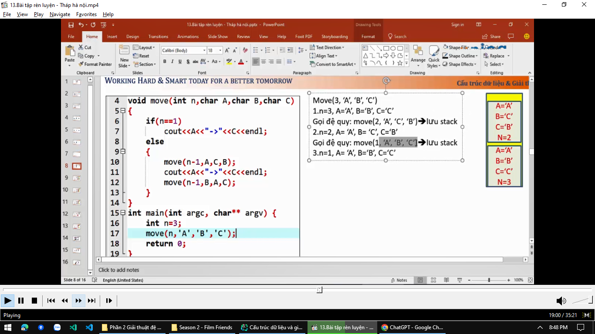
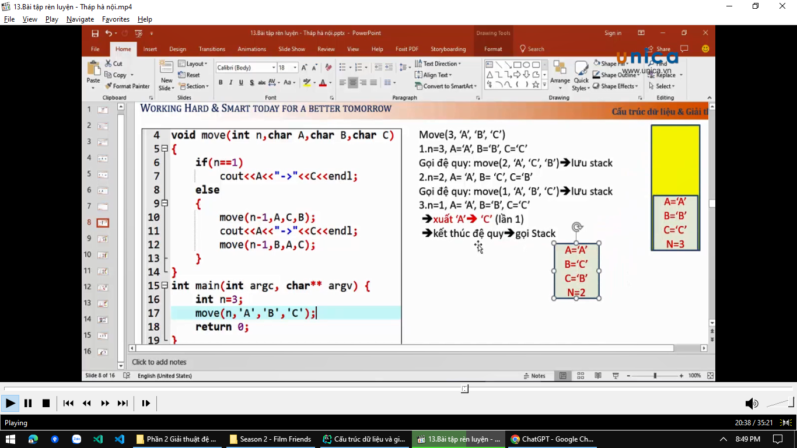
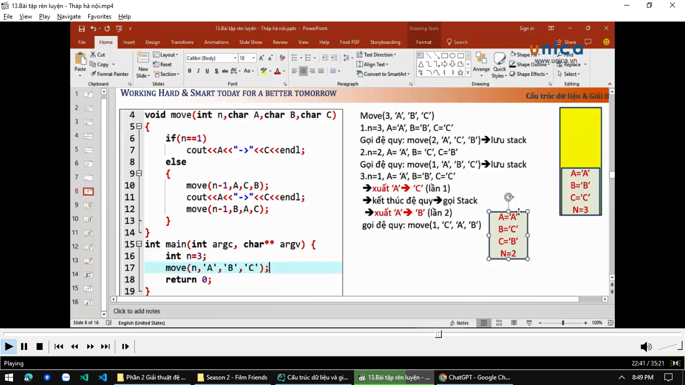
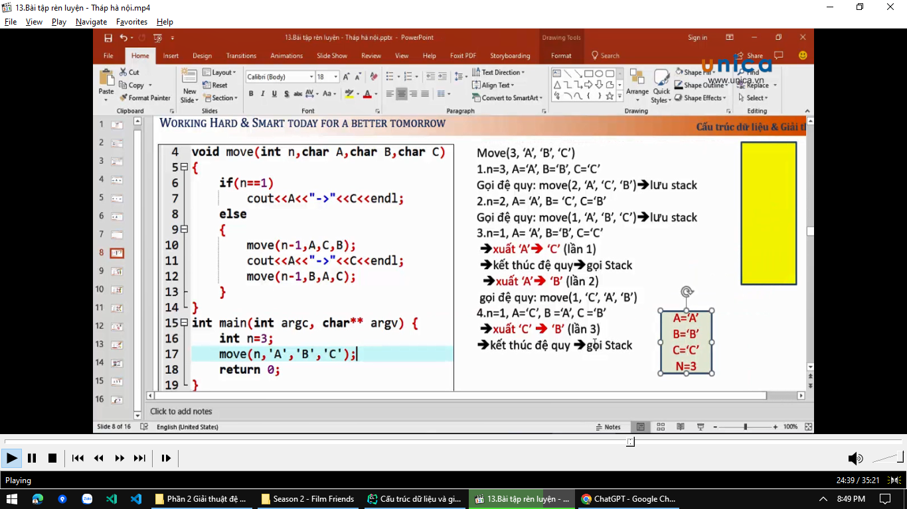
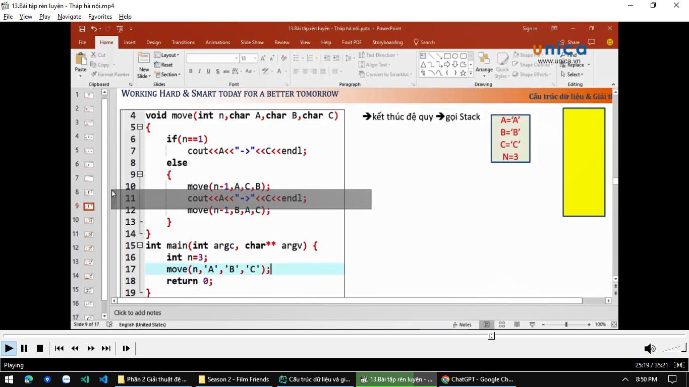
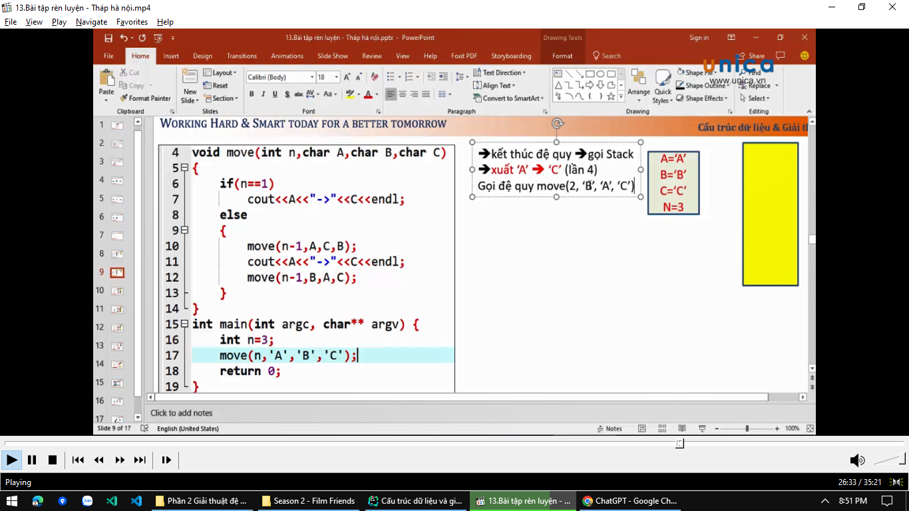
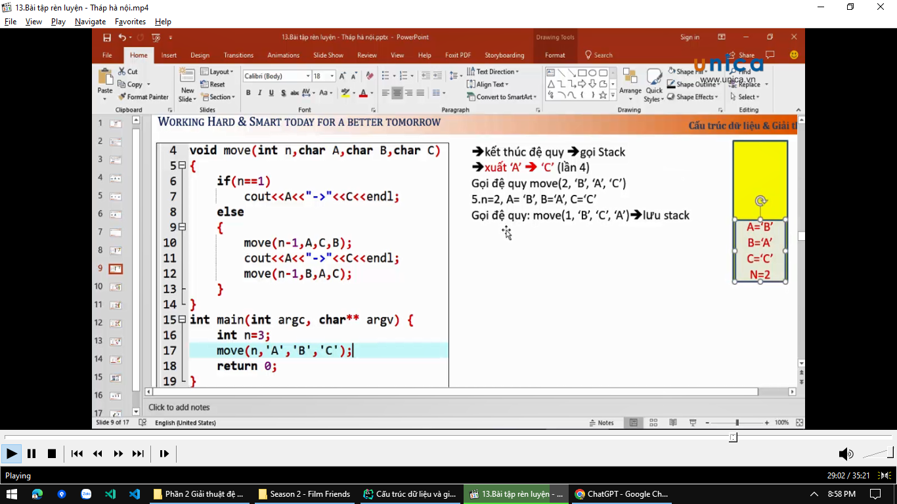
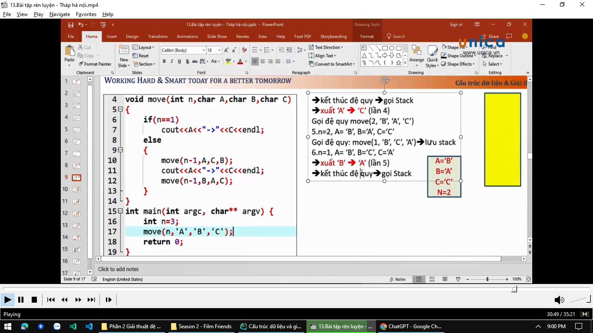
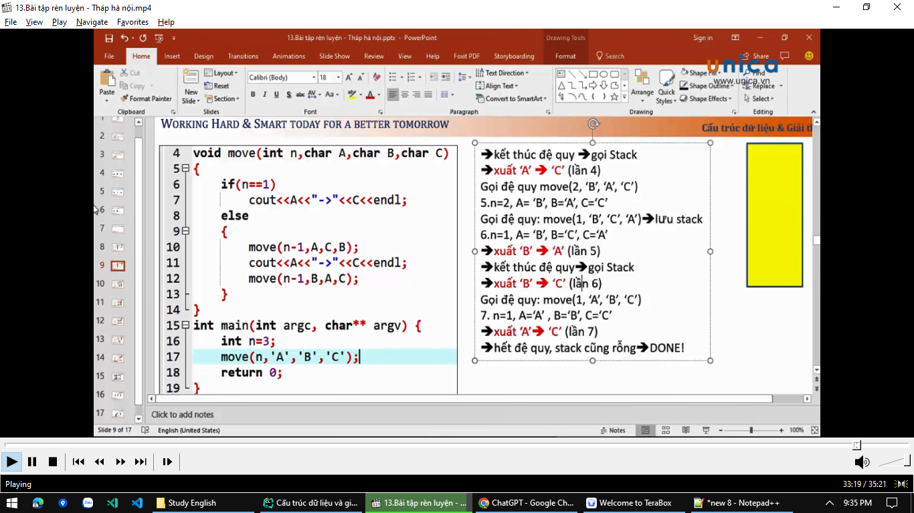

# Giải thích luồng code chạy

> Thuật toán này có dạng 2^n - 1

```md
> Ví dụ: Nếu chúng ta truyền n = 3 thì ta có được số lần chạy là 2^3 - 1 = 7

> Và trong ví dụ của chúng ta, mình đã truyền n = 3. Và đúng như vậy, ta có kết quả là 7 lần chạy
```



- khi gọi đệ quy thì nó sẽ lưu vào stack. Trong stack gồm có các giá trị A,B,C và N
- Khi gọi stack thì nó bắt đầu gọi ở hàng thứ 11
- Nó lại tiếp tục chạy đệ quy `3-1=2`, khi bằng 2 thì nó quay lên kiểm tra điều kiện tiếp, xem thử n có bằng 1 chưa.
- Sau khi kiểm tra thấy n chưa không bằng 1 thì tiếp tục chạy đệ quy tiếp



- `n = 1`, thì nó xuất ra `A -> C`. Nó xuất xong rồi, thì nó hết đệ quy. Hết đệ quy thì nó bắt đầu gọi stack.
- Lưu ý: Kết thúc đệ quy thì gọi stack



- Nó sẽ lấy stack có `n=2` ra trước. Và thực hiện chạy dòng code 11
- Trong stack A nó vẫn là A, còn C lúc này là B rồi
- Tiếp đó nó gọi đệ quy tiếp (dòng 12). Đó là nó gọi move(n-1) suy ra move(2-1) = move(1). B lúc này là C, A lúc này là A, C lúc này là B

=> Sau khi lôi stack ra và tính toán xong thì nó sẽ xóa ra khỏi stack

> do hết slide nên mình chuyển qua slide mới

- Và cứ thế mà chúng ta tính toán cho các đệ quy tiếp theo





- Tới lần gọi số 5, nó gọi hàm -> tính trong hàm xong chúng ta có n = 2. Mà n = 2 thì chúng ta không thỏa điều kiện trong if. Nếu không chạy vào if thì nó sẽ chạy vào else để gọi đệ quy. Gọi đệ quy xong thì nó lưu vào stack



> Lưu ý: kết thúc đệ quy là chúng ta gọi stack liền

- Tới lần số 6 thì chúng ta gọi hàm và có được n = 1. Sau đó nó xuất ra được giá trị rồi, thì nó không gọi hàm nữa. Không gọi hàm nữa thì nó sẽ lôi giá trị trong stack ra
- Nó thực hiện dòng code 11 để xuất giá trị ra. A lúc này là B, C lúc này C
- Sau đó nó thực hiện dòng 12, và cứ thế nó tính...




=> Tổng cộng lại chúng ta có 7 lần chạy
