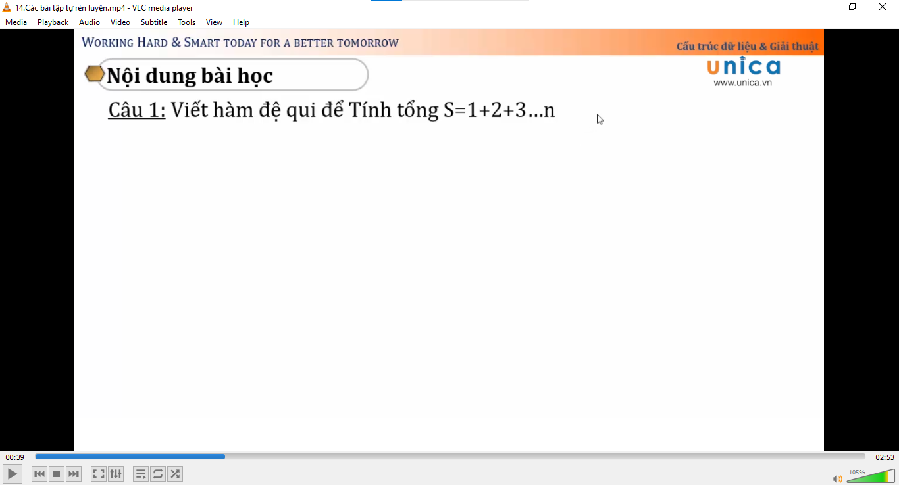
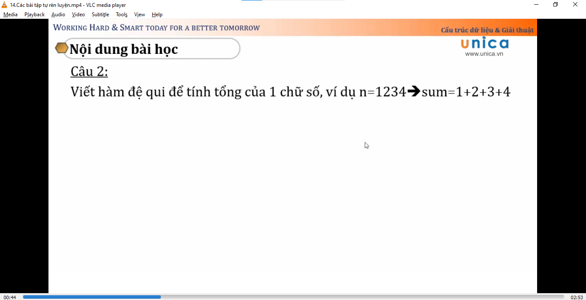
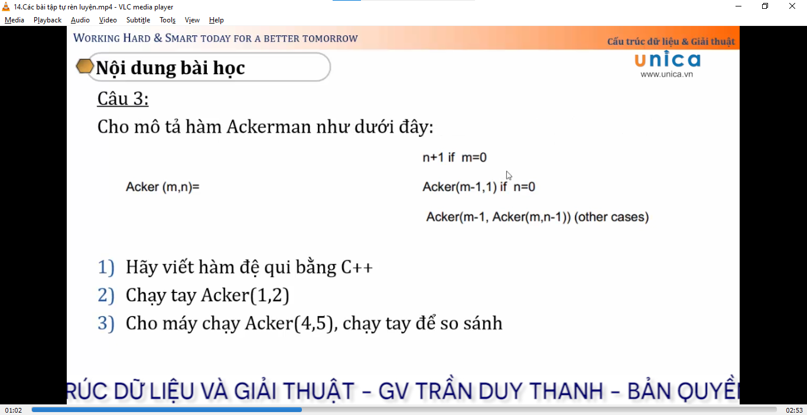
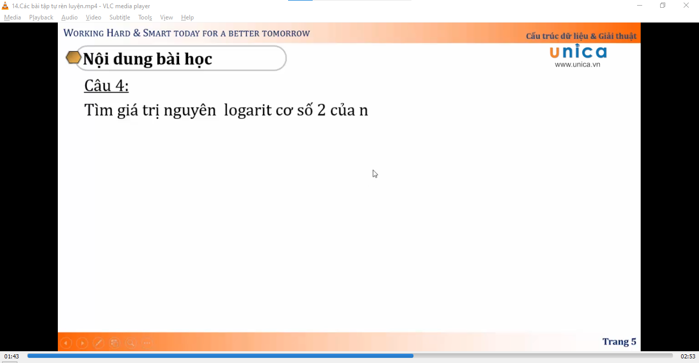
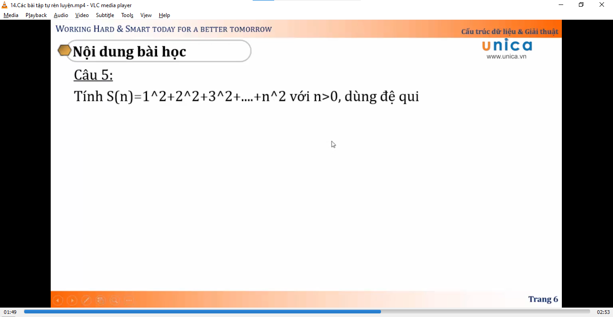
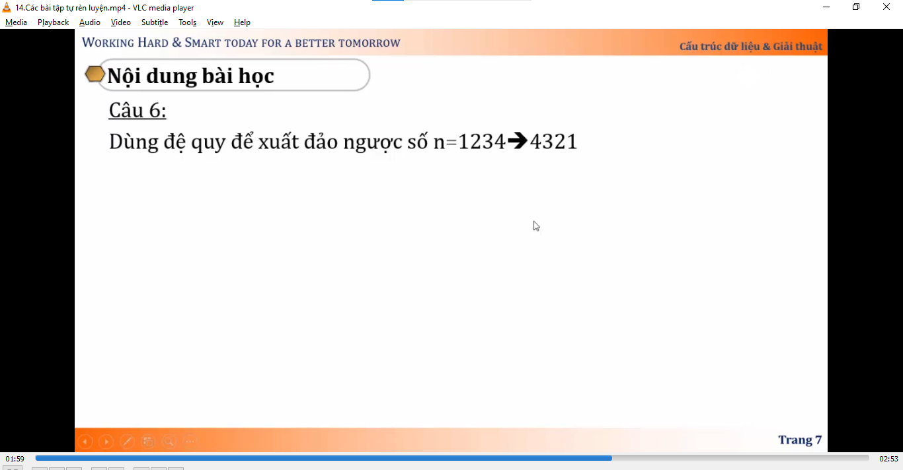

Trong bài này thầy chỉ đưa ra những đề bài và mình phải tự giải để cho quen tay, đồng thời ôn lại kiến thức cũ

---

# Dưới đây là các bài tập

1. Bài 1

2. Bài 2

3. Bài 3

4. Bài 4

5. Bài 5

6. Bài 6

