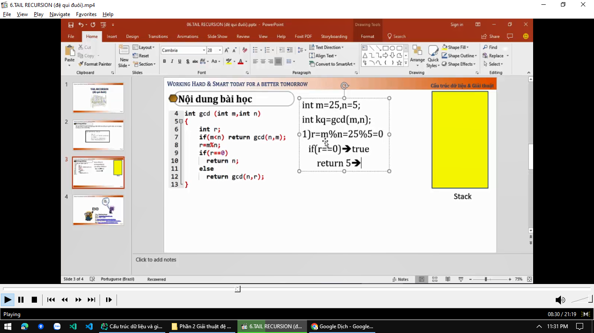
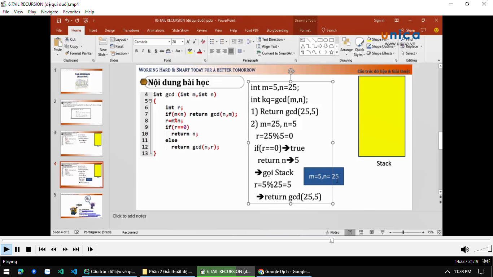
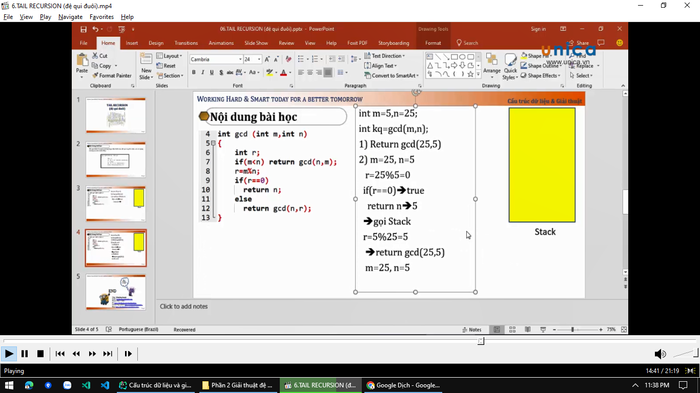
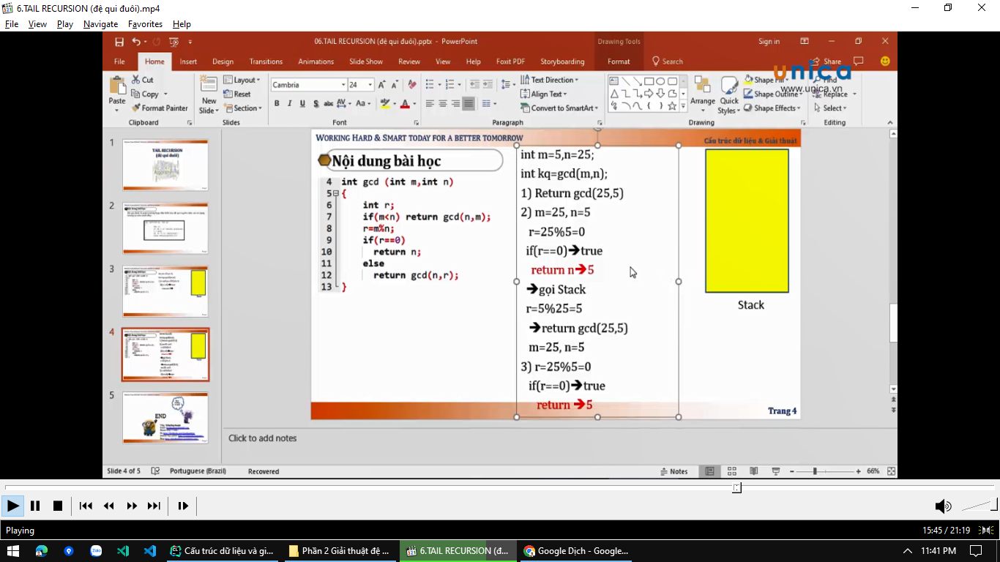
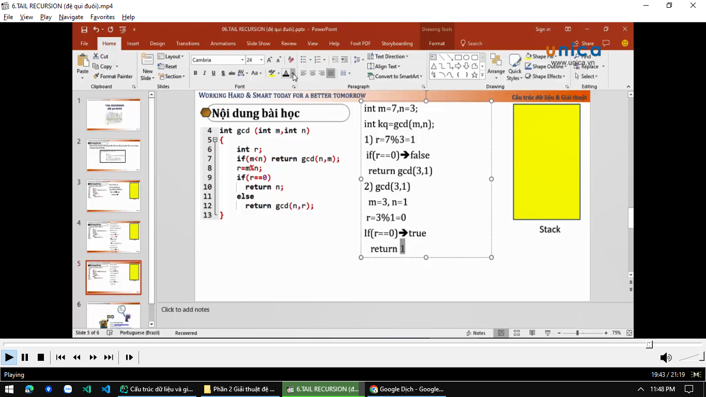

# Phân tích code thực thi

Cứ code đệ quy thì code đó có 1 stack -> thực thi theo nguyên tắc LIFO (Last In First Out)

Đây là trường hợp m = 25, n = 5
trường hợp 1

---

Đây là trường hợp m = 5, n = 25
trường hợp 2: nó return 2 lần. Khi nào mà stack nó rỗng thì code nó sẽ kết thúc

---

Đây là trường hợp m = 7, n = 3
trường hợp 3: return 1 giá trị cụ thể nào đó, mà trong stack rỗng -> thì coi như kết thúc chương trình. Thì rõ ràng bài
toán này nó return 1, thì coi như code chạy đến đó và kết thúc lun

---

=> Vậy qua bài này chúng ta biết bài toán này có ý nghĩa gì không? Đó là tìm `ước chung lớn nhất`. Có rất nhiều giải
thuật
để làm, nhưng mà ở đây chúng ta sử dụng `đệ quy` để làm

=> Tùy vào từng dữ liệu input đầu vào mà chúng ta sẽ xử lý nó khác nhau. Như `trường hợp 1` thì code chạy rất nhanh, nó
chạy cái rụp phát ra đáp án lun. Nhưng nếu như `trường hợp 2` thì nó sẽ làm rất nhiều bước: như là gọi đệ quy -> đưa vào
stack -> gọi stack ra để nó chạy tiếp