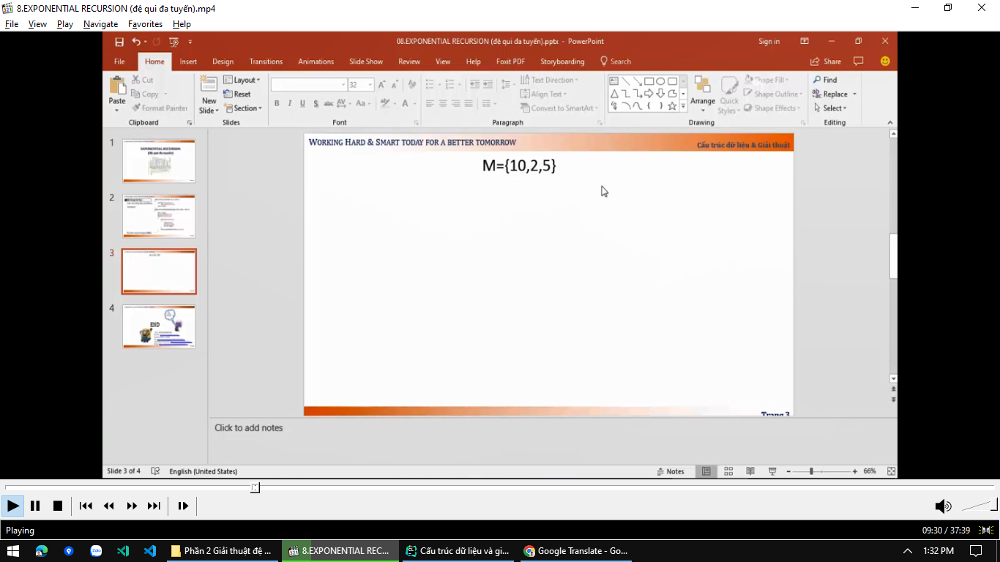
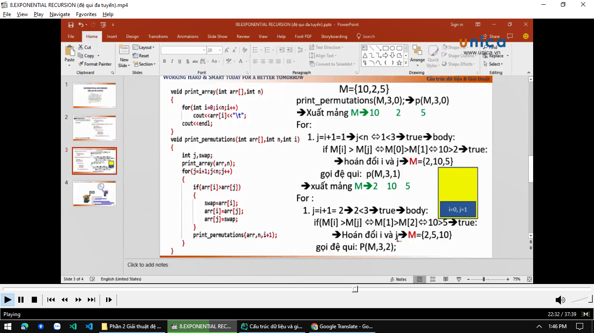
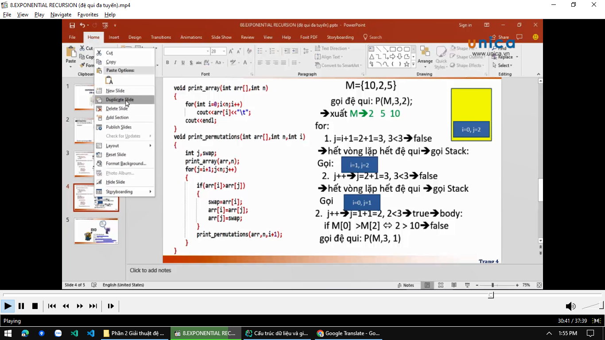
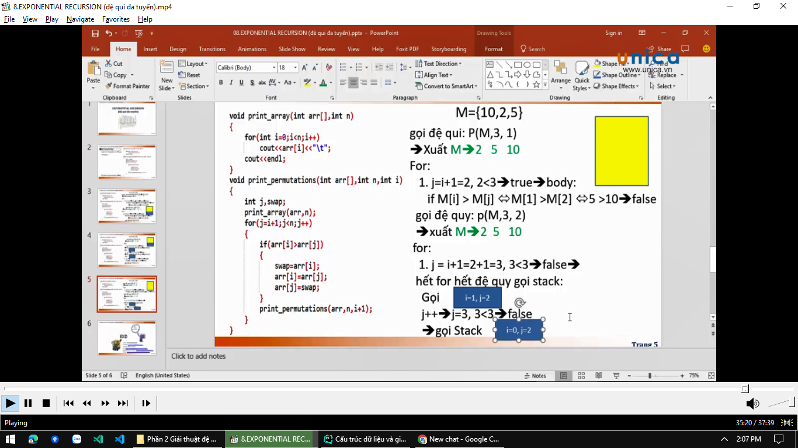
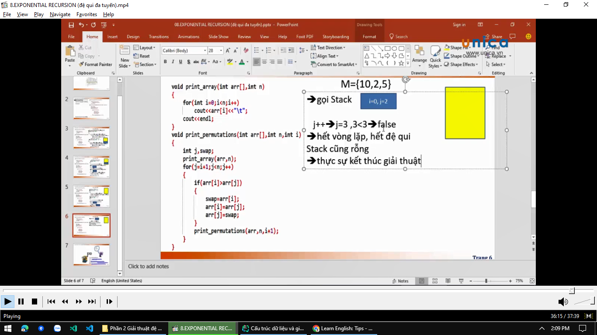
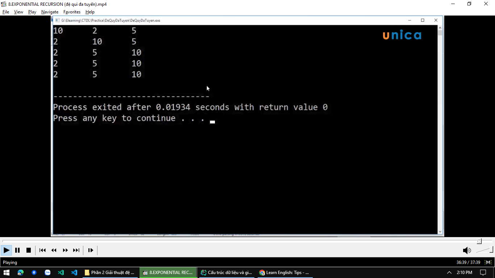

# Giải thích luồng code chạy

tiếp tục với slide trên (do dài quá nên tạo 1 slide khác)

tiếp tục với slide trên (do dài quá nên tạo 1 slide khác)

tiếp tục với slide trên (do dài quá nên tạo 1 slide khác)

=> kết quả:

=> Tổng cộng có 5 lần xuất ra mảng (trong slide chỗ xuất ra có in màu xanh lá cây)