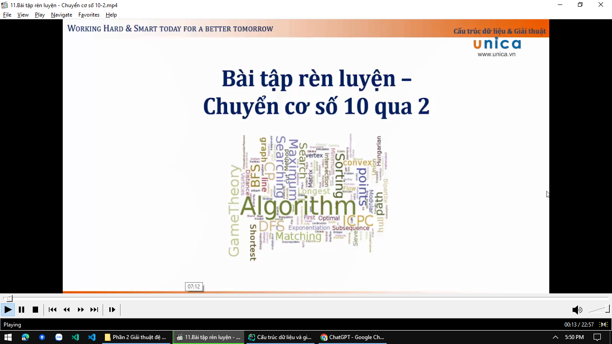
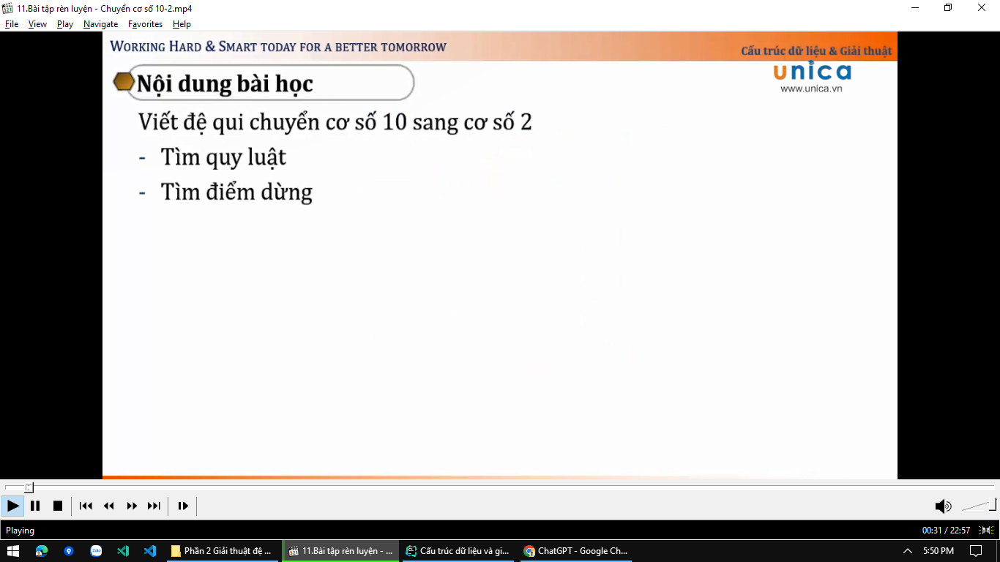
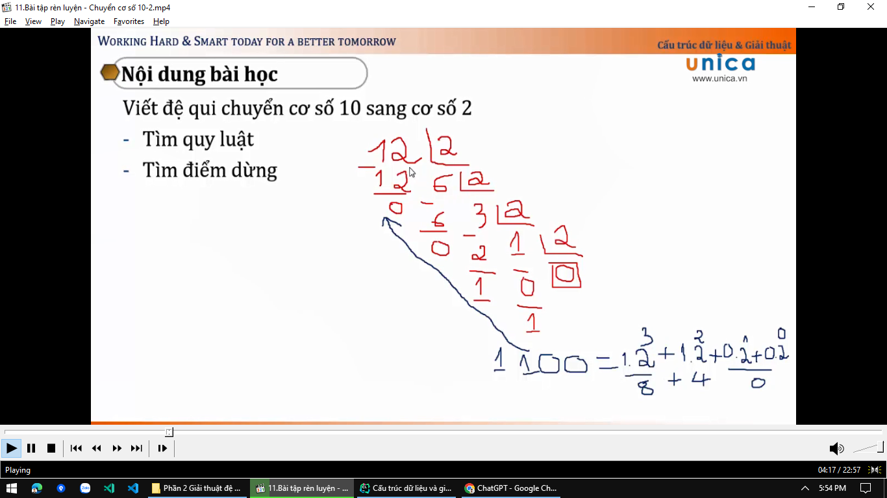
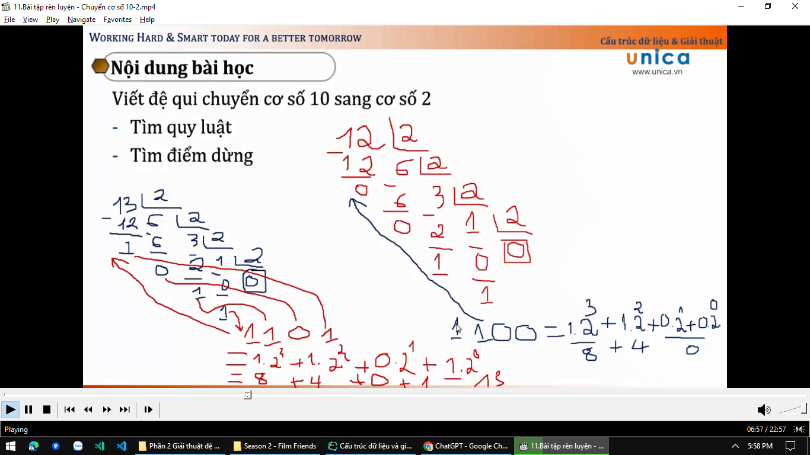

# 11.Bài tập rèn luyện - Chuyển cơ số 10-2

Quy luật là lấy số cần chuyển sang số nhị phân, lấy số đó chia cho 2 -> chia cho đến khi kết quả bằng 0 -> sau đó chúng
ta lấy phần dư -> lấy kết quả ngược lên trên -> là ra số nhị phân

